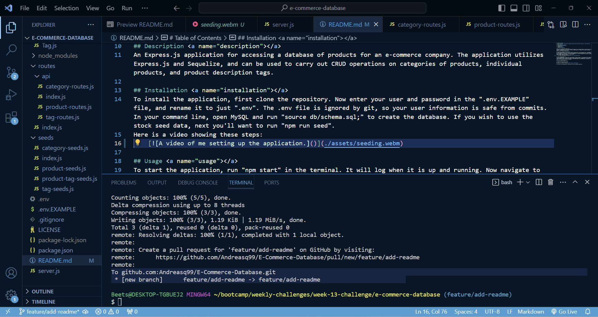
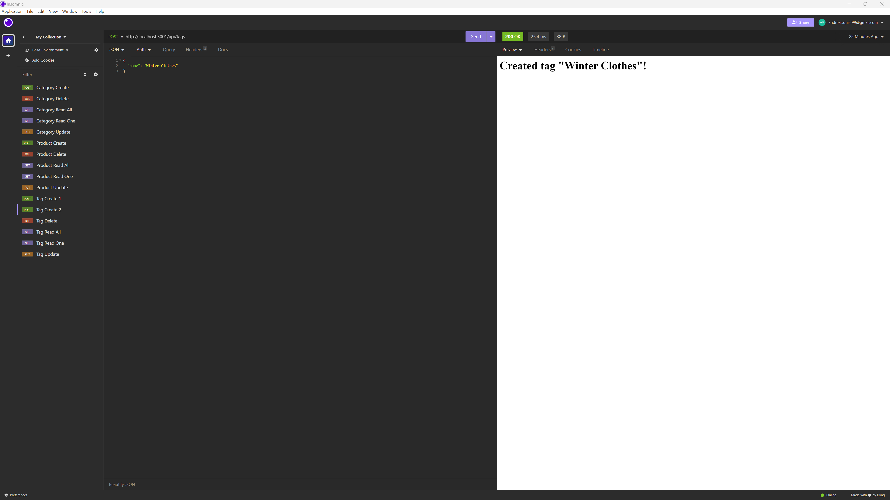

# E-Commerce Database

# Table of Contents
1. [Description](#description)
2. [Installation](#installation)
3. [Usage](#usage)
6. [License](#license)
7. [Questions](#questions)

## Description 
An Express.js application for accessing a database of products for an e-commerce company. The application utilizes Express.js and Sequelize, and can be used to carry out CRUD operations on categories of products, individual products, and product description tags.

## Installation 
To install the application, first clone the repository.
 1. Enter your user and password in the "[.env.EXAMPLE](.env.EXAMPLE)" file
 2. Rename the "[.env.EXAMPLE](.env.EXAMPLE)" file to just ".env". The .env file is ignored by git, so your user information is safe from commits.
 3. In the terminal, open MySQL and run "source db/schema.sql;" to create the database.
 4. If you wish to use the stock seed data, run "npm run seed".

Here is a video showing these steps:
    

## Usage 
1. To start the application, run "npm start" in the terminal. It will log when it is up and running.
2. To carry out CRUD operations, navigate to Insomnia and input the address "http://localhost:3001". 
3. If you wish to access categories, you can carry out GET, POST, PUT, and DELETE requests at /api/categories, and similarly for products at /api/products and tags at /api/tags.

Here is a video showing these steps: 
    

## License 
This application uses the MIT license.

## Questions <a name="questions"><a>
My GitHub can be found at [GitHub.com](https://github.com/Andreasq99).

You can email me at aquist@unc.edu. Please email me with any additional questions!
